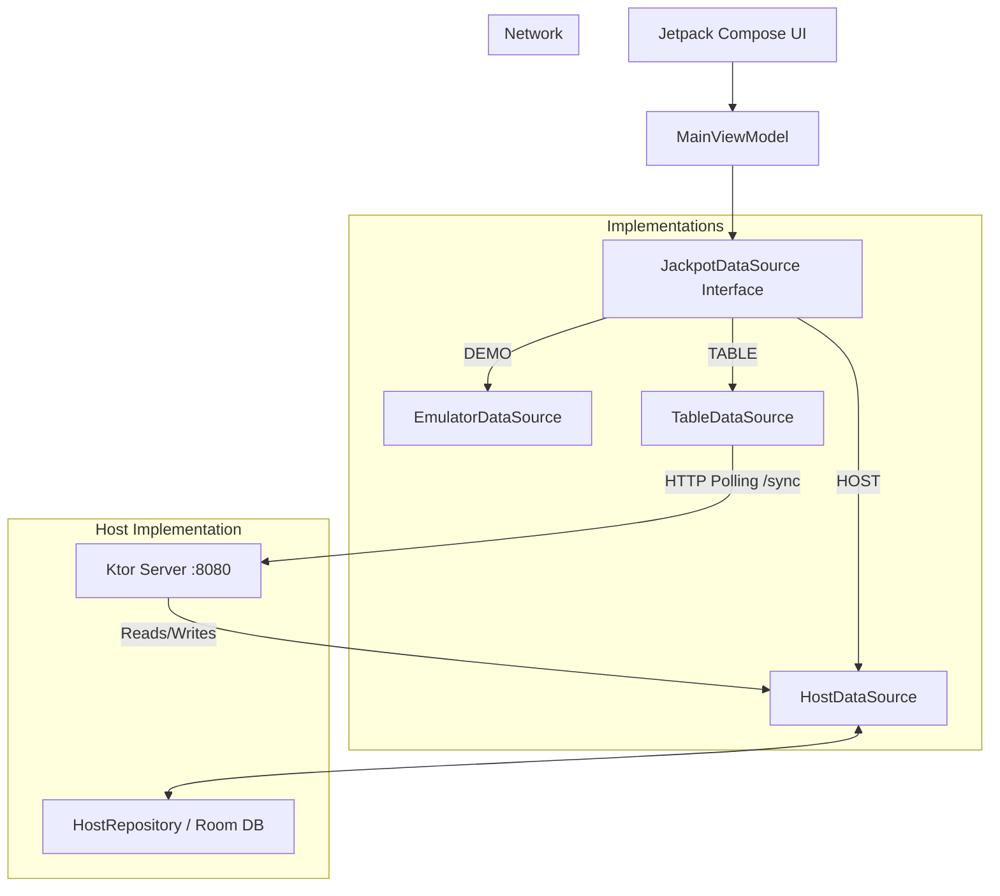

# Mystery Jackpot Display

Проект представляет собой Android-приложение для системы Mystery Jackpot, которое работает в трех режимах (ролях) в рамках одного APK. Приложение обеспечивает синхронизацию состояния игровых столов и джекпотов между устройствами управляющего (Host) и отображающего (Table) типа.

## 🏗 Архитектура

Приложение построено на принципах Unidirectional Data Flow (UDF).
`UI (Compose)` <-> `ViewModel` <-> `JackpotDataSource` (Interface).

Реализация `JackpotDataSource` зависит от выбранной роли устройства:



### Основные компоненты

*   **RoleRouter** (`ui/RoleRouter.kt`): Входная точка. Определяет, какой экран показать (выбор роли или основной экран) и создает правильный `DataSource`.
*   **DataSourceProvider** (`model/DataSourceProvider.kt`): Фабрика, создающая реализацию источника данных.
*   **HostHttpServer** (`host/net/HostHttpServer.kt`): Встроенный веб-сервер (Ktor), запускаемый в режиме HOST. Раздает состояние и принимает команды.
*   **TableDataSource** (`table/TableDataSource.kt`): Клиент, который опрашивает HOST сервер (long polling эмуляция) и преобразует JSON-события в `DemoEvent` для UI.

---

## 📱 Роли и режимы

При первом запуске (или после сброса) приложение просит выбрать роль:

1.  **DEMO**:
    *   Локальный режим.
    *   `Emulator` генерирует случайные ставки и выигрыши.
    *   Сеть не используется.

2.  **HOST** (Сервер):
    *   Является "мозгом" системы.
    *   Хранит состояние джекпотов и столов в базе данных (Room).
    *   Запускает HTTP сервер на порту **8080**.
    *   Принимает команды управления (через API).
    *   Раздает события подключенным столам.

3.  **TABLE** (Клиент):
    *   Режим отображения для конкретного стола/группы столов.
    *   Подключается к HOST по указанному URL (например, `http://192.168.1.5:8080`).
    *   Синхронизирует состояние и анимации выигрыша.

---

## 🚀 Запуск и настройка

### 1. Локальный запуск (Один эмулятор)
1. Запустите приложение в Android Studio.
2. Выберите роль **DEMO**.
3. Приложение начнет симуляцию игры.

### 2. Запуск "HOST + TABLE" на двух Android-эмуляторах
*Важно: Эмуляторы Android находятся за виртуальным NAT и не видят друг друга напрямую по локальной сети. Нужно использовать `adb forward`.*

1.  **Запуск HOST**:
    *   Запустите Эмулятор А.
    *   В приложении выберите роль **HOST**.
    *   Сервер запустится на внутренней сети эмулятора (порт 8080).

2.  **Настройка сети для TABLE**:
    *   Узнайте port эмулятора HOST (обычно 5554) и TABLE (обычно 5556).
    *   Пробросьте порт с хост-машины (ваш ПК) на эмулятор TABLE:
        ```bash
        # Находим Device ID для эмулятора TABLE (например, emulator-5556)
        adb devices 
        # Пробрасываем порт 8080 на этот эмулятор
        adb -s emulator-5556 reverse tcp:8080 tcp:8080
        ```
    *   *Альтернатива*: Использовать IP адрес хост-машины (10.0.2.2), если сервер запущен на ПК, но в данном случае сервер внутри другого Android. Проще всего запускать HOST на реальном телефоне, а TABLE на эмуляторе.

### 3. Запуск в реальной Wi-Fi сети (Рекомендуемый)
1.  **HOST (Телефон А)**:
    *   Подключитесь к Wi-Fi.
    *   Запустите приложение -> **HOST**.
    *   Узнайте локальный IP телефона (Настройки -> О телефоне -> Статус или через Wi-Fi меню). Например: `192.168.1.10`.
2.  **TABLE (Телефон Б)**:
    *   Подключитесь к той же Wi-Fi сети.
    *   Запустите приложение -> **TABLE**.
    *   В поле Host URL введите: `http://192.168.1.10:8080` (замените IP на реальный).
    *   Нажмите START.

---

## 🔌 API (HostHttpServer)

Сервер работает на порту `8080`. Ответы в формате JSON.

### Состояние
*   `GET /health` — Проверка доступности. Возвращает `{ "ok": true }`.
*   `GET /snapshot` — Полный дамп текущего состояния (jackpots, tables).
*   `GET /sync?afterEventId={id}` — Long-polling событий. Возвращает список событий, произошедших после указанного ID.

### Управление (Input)
*   `POST /input/toggle` — { tableId, boxId } (переключить активность бокса).
*   `POST /input/confirm` — { tableId } (подтвердить ставки).
*   `POST /input/payout/selectBox` — { tableId, boxId } (выбор бокса дилером при выигрыше).
*   `POST /input/payout/confirm` — { tableId } (подтверждение выплаты и сброс джекпота).

---

## 🛠 Troubleshooting

1.  **TABLE пишет "OFFLINE"**:
    *   Убедитесь, что устройства в одной сети.
    *   Проверьте правильность IP адреса HOST.
    *   Убедитесь, что формат URL начинается с `http://` и заканчивается портом `:8080`.
    *   HOST приложение должно быть запущено и активно (не убито системой).

2.  **Cleartext Traffic Error**:
    *   Приложение настроено (`AndroidManifest.xml`) на разрешение HTTP трафика (`usesCleartextTraffic="true"`). Если возникают ошибки, проверьте логи на наличие `SecurityException`.

3.  **Как сменить роль**:
    *   На главном экране быстро нажмите **5 раз** на логотип "Mystery Jackpot" в центре.
    *   Приложение сбросит настройки и перезапустит экран выбора роли.

4.  **Сбой порта 8080**:
    *   Если при запуске HOST в логах ошибка `BindException: Address already in use`, значит порт занят. Обычно это происходит, если старый процесс сервера не был корректно остановлен.
    *   Решение: Полностью закройте приложение (Force Stop) и запустите снова.

---

## 🔮 TODO & Future Improvements

1.  **Service Discovery**: Реализовать NsdManager (mDNS) для автоматического поиска HOST в локальной сети, чтобы не вводить IP вручную.
2.  **WebSocket**: Заменить polling `/sync` на WebSocket для мгновенной доставки событий.
3.  **Security**: Добавить `Authorization` header с токеном для админских эндпоинтов `/input/*`.
4.  **Dynamic Port**: Разрешить выбор порта в настройках, если 8080 занят.
5.  **UI Settings**: Добавить явную кнопку настроек для смены роли (сейчас скрыта за 5 кликами).

